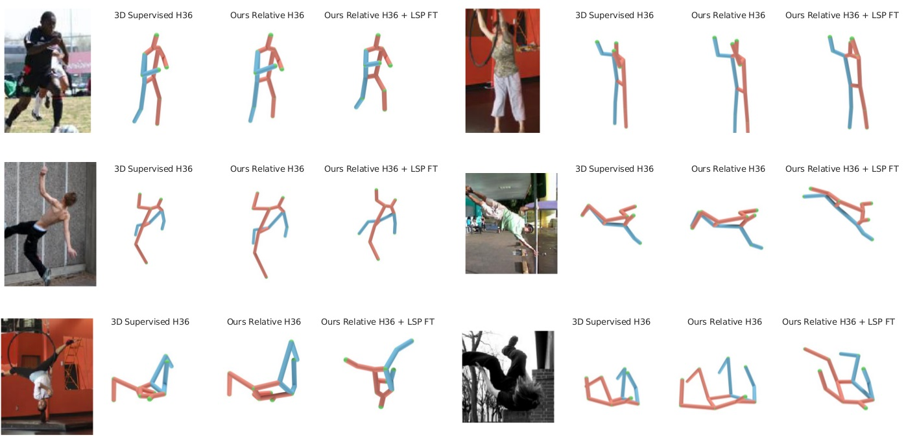

# It's all Relative: Monocular 3D Human Pose Estimation from Weakly Supervised Data

This repository recreates the experiments and plots from our BMVC 2018 paper. You can find the paper [here](https://arxiv.org/abs/1805.06880), along with additional data on our [project website](http://www.vision.caltech.edu/~mronchi/projects/RelativePose/).

### Overview
 - `run_model.py`   : Runs a pre-trained model on an input numpy array containing a 2D pose and predicts and visualizes the corresponding 3D pose.
 - `main_human36.py`: Trains and tests a model with 17 2d input and 3d output keypoints on the [Human3.6M dataset](http://vision.imar.ro/human3.6m/description.php).
 - `main_lsp.py`    : Trains and tests a model with 14 2d input and 3d output keypoints on the [LSP dataset](http://sam.johnson.io/research/lsp.html).
 - `paper_exps/`    : Contains the files for replicating the experiments contained in the paper. **NOTE**: Running the files in this directory will train the models from scratch. You can find the instructions for downloading pre-trained models [here](checkpoint/readme.md).
 - `paper_plots/`: Contains the files to plot the figures contained in the paper. **NOTE**: To plot a figure you must either run the corresponding file from `paper_exps/` or download the pre-trained models from `checkpoints/`.
 - `opts/`: Contains the parameter settings to train and test a new model on either Human3.6M or LSP and to replicate the experiments in the paper.


### Requirements
The code was developed using Python 2.7 and PyTorch 0.3.1.


### Results
Here we show some sample outputs from our model on the LSP dataset. For each set of results we first show the input image, followed by the results of the fully supervised lifting approach of [Martinez et al.](https://arxiv.org/abs/1705.03098) (3D Supervised H36). Despite using significantly less information at training time our model produces plausible output poses (Ours Relative H36). Fine-tuning on crowd annotations collected on LSP further improves the quality of the 3D poses (Ours Relative H36 + LSP FT).    




### Video
<a href="https://www.youtube.com/watch?feature=player_embedded&v=fClQN8iVreM" target="_blank">
</a>

### Reference
If you find our work useful in your research please cite our paper:  
```
@inproceedings{relativeposeBMVC18,
  title     = {It's all Relative: Monocular 3D Human Pose Estimation from Weakly Supervised Data},
  author    = {Ronchi, Matteo Ruggero and Mac Aodha, Oisin and Eng, Robert and Perona, Pietro},
  booktitle = {BMVC},
  year = {2018}
}
```

### Original Code
Uses some code from [here](https://github.com/weigq/3d_pose_baseline_pytorch) which is a PyTorch implementation of [Martinez et al.](https://github.com/una-dinosauria/3d-pose-baseline)'s tensorflow code.
